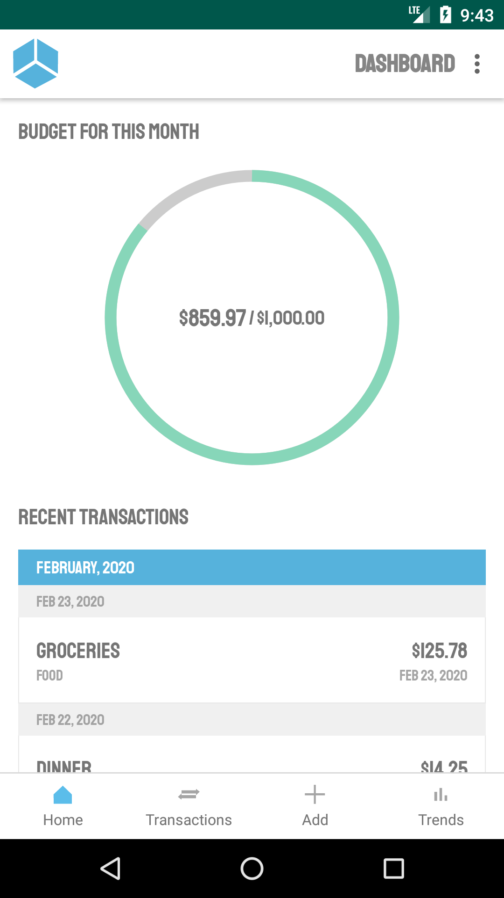

# Shoebox

Shoebox is an android application that helps you budget expenses and track your spending. It aims to 
be as uncomplicated as possible by only providing features essential to your daily spending. Shoebox 
does not integrate with any of your bank accounts and is strictly an offline application making it
fast, easy to use, and simple to get started with! 

## Highlighted Features

<table>
    <tr>
        <td width="30%">
            
        </td>
        <td>
            The home screen shows you a quick snapshot of how much you've spent for the current 
            month as well as your recent transactions. Every transaction within the month will be
            deducted from your monthly budget showing you the remaining amount that you have to 
            spend until the next month.
             
             
            When first installing the app, you get to choose your default monthly budget. If you 
            want to change your budget for a certain month or for every month going forward, you can 
            update your schedule from the settings menu. 
        </td>
    </tr>
    <tr>
        <td width="30%">
            
        </td>
        <td>
            Search all of your transactions by criteria such as price, category, date, and title. 
            Shoebox does not integrate with your bank account or any financial institution. 
            Transactions are manually entered with only the information you choose to store
            including the title and category of your choice. 
        </td>
    </tr>
    <tr>
        <td width="30%">
            
        </td>
        <td>
            Get a complete view of all of your spending habits over the past few months or years.
            You can view your total budget over the past few months or years to view your overall
            progress and the amount that you've saved over time.
        </td>
    </tr>
</table

---

## License

Licensed under the Apache License, Version 2.0
